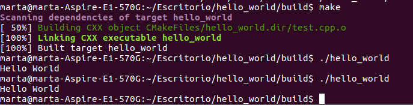

# Hello World amb CMake

Per tal de crear un primer programa senzill amb el Cmake, s’ha realitzat el executable hello_world. Per tal de realitzar-lo, només s’ha de generar un arxiu  .cpp amb el codi que generarà el ‘Hello World’ a dins, i un arxiu de text anomenat CmakeLists.txt. En cada arxiu respestivament inclourem el següent:

Aquests arxius els posem a dins d’una carpeta anomenada hello-world. Per tal de generar l’executable, simplement realitzarem una sèrie de comandes estant a dins d’aquest directori. 
La primera comanda és mkdir build, el que ens permet crear dins de la carpeta un directori per al build del executable. Veurem que la carpeta s’ha creat a dins de la carpeta hello_world.

Seguidament ens col·loquem a dins del directori build amb la comanda cd build. Un cop a dins executem la comanda cmake .. , que genera els arxius de build per al programa. Per a generar finalment l’executable, es fa amb la comanda make.

Com es veu a la imatge, ja es pot executar el programa simplement amb la comanda ./hello_world. Seguidament veiem el resultat, que simplement surt el missatge ‘Hello World’.
